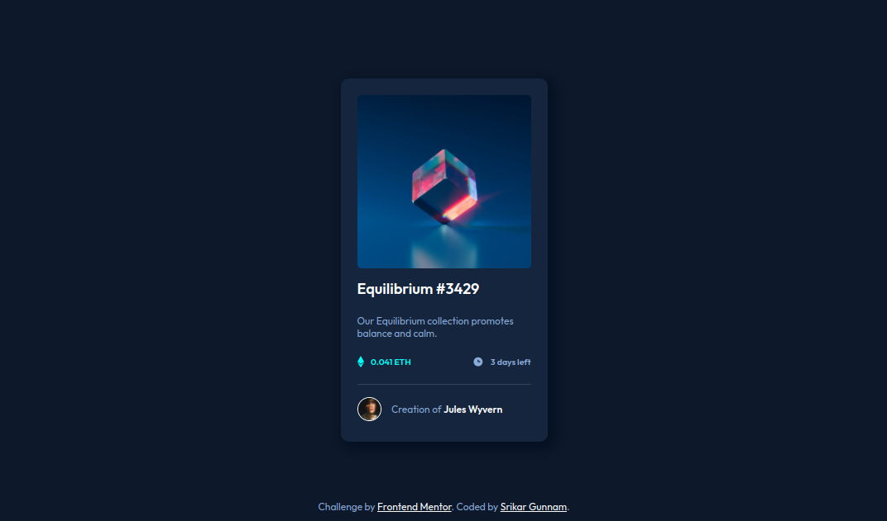

# Frontend Mentor - NFT preview card component solution

This is a solution to the [NFT preview card component challenge on Frontend Mentor](https://www.frontendmentor.io/challenges/nft-preview-card-component-SbdUL_w0U). Frontend Mentor challenges help you improve your coding skills by building realistic projects. Try [Frontend Mentor](https://frontendmentor.io/) for free.

## Table of contents

- [Frontend Mentor - NFT preview card component solution](#frontend-mentor---nft-preview-card-component-solution)
  - [Table of contents](#table-of-contents)
  - [Overview](#overview)
    - [Screenshot](#screenshot)
    - [Links](#links)
  - [My process](#my-process)
    - [Built with](#built-with)
    - [What I learned](#what-i-learned)
    - [Useful resources](#useful-resources)
  - [Author](#author)

## Overview

### Screenshot

### Links

- [Solution URL](https://github.com/srikargunnam/frontendmentor-nft-preview-card)
- [Live Site URL](https://srikargunnam.github.io/frontendmentor-nft-preview-card/)

## My process

### Built with

- HTML5 markup
- CSS properties
- Flexbox
- Mobile-first workflow
- Responsive layout

### What I learned

I learned how to use CSS to conditionally style the elements. I used this technique to mask the main image when a user hovers on it and show an image that was initially hidden 

### Useful resources

- [Stackoverflow](https://stackoverflow.com/) - This site helped me a lot in getting answers to the problems which i faced while doing this project.

## Author

- Website - [Srikar Gunnam](https://srikargunnam.com)
- Frontend Mentor - [@srikargunnam](https://www.frontendmentor.io/profile/srikargunnam)
- Twitter - [@SrikarGunnam](https://twitter.com/SrikarGunnam)
- Codepen - [@srikargunnam](https://codepen.io/srikargunnam)
- GitHub - [@srikargunnam](https://github.com/srikargunnam/)